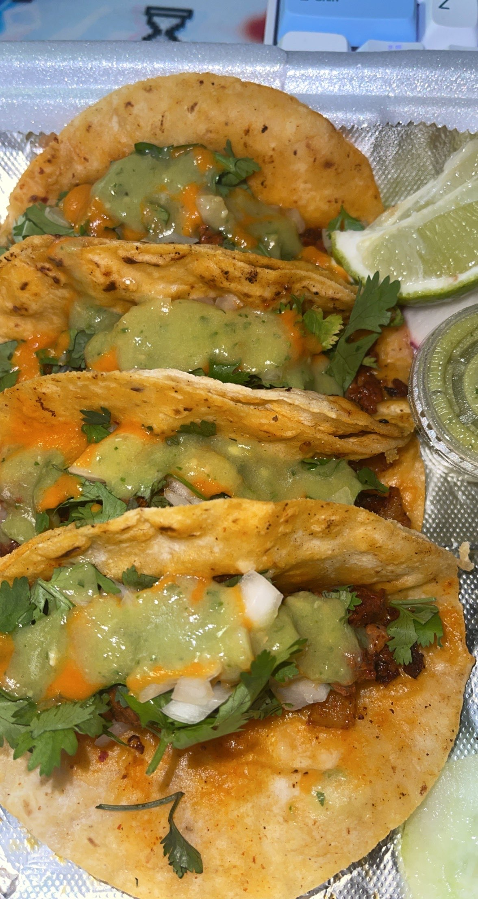
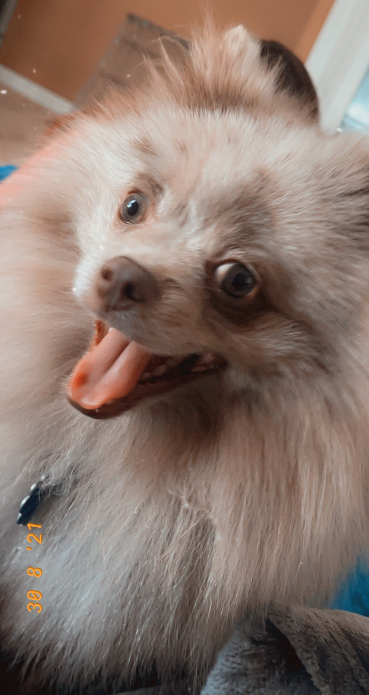

# Ruby's User Page

## **About Me**
- [Ruby's User Page](#rubys-user-page)
  - [**About Me**](#about-me)
    - [**Who am I?**](#who-am-i)
    - [**Who am I as a Programmer and Computer Scientist?**](#who-am-i-as-a-programmer-and-computer-scientist)
    - [**More About Me**](#more-about-me)
      - [Programming Languages](#programming-languages)
      - [Food Adventures](#food-adventures)
      - [What I am Playing](#what-i-am-playing)
      - [Top 3 Favorite Anime/Manga](#top-3-favorite-animemanga)
      - [Favorite Budget Meal](#favorite-budget-meal)
  - [**Expectations for CSE 110**](#expectations-for-cse-110)
        - [Coco making the cut](#coco-making-the-cut)
### **Who am I?**
Hi! My name's Ruby, some people call me RC (first letter of my first and middle name). You might recognize me in class as the girl with the crazy hair colors. Currently I am a *senior* (YAY) and am graduating in the Spring of 2022! Some of my favorite things include playing video games, binge watching Netflix and anime movies/series, going on food adventures (in Tijuana), and hanging out with friends.  

### **Who am I as a Programmer and Computer Scientist?**
As a programmer, my favorite programming languages are Python and SQL. In the future, I hope to become a Data Analyst (I am really ~~interested in~~ attracted and intrigued by Data Science) or a Software Developer.

### **More About Me**
#### Programming Languages 
- JAVA \
``` System.out.print("Hello world!") ```
- C/C++ \
``` printf("Hello world!") ```
- Python (with Pandas as well) \
``` print("Hello world!")```
- HTML/CSS (some JS) \
``` <p> Hello world! </p> ```
- Some ARM

#### Food Adventures 

![] 
#### What I am Playing
- Dead by Daylight 
- Valorant
- Bloodhunt
- Genshin Impact

#### Top 3 Favorite Anime/Manga
1. [Attack on Titan](https://en.wikipedia.org/wiki/Attack_on_Titan)
2. [The Promised Neverland](https://en.wikipedia.org/wiki/The_Promised_Neverland)
3. [Made in Abyss](https://en.wikipedia.org/wiki/Made_in_Abyss/)

#### Favorite Budget Meal 
[Sopa de Fideo](secretformula.md)

## **Expectations for CSE 110**
I'll update these as the quarter continues: 
- [ ] Have a good group 
- [ ] Have fun 
- [ ] Learn new things regarding software engineering/development
- [ ] Gain experience 
- [x] Have a cool professor

I'm hoping to do well in this class, gain experience and insights in the reality of Software Development and Engineering, and have a great time. I plan on putting forth a lot of work and effort in this class, especially considering that it is a group effort (which, in my opinion, ends up being more work than an individual task). So, in the words of Elle Woods: 
> I'll show you how valuable ~~Elle Woods~~ Ruby Marroquin can be!

##### Coco making the cut 
